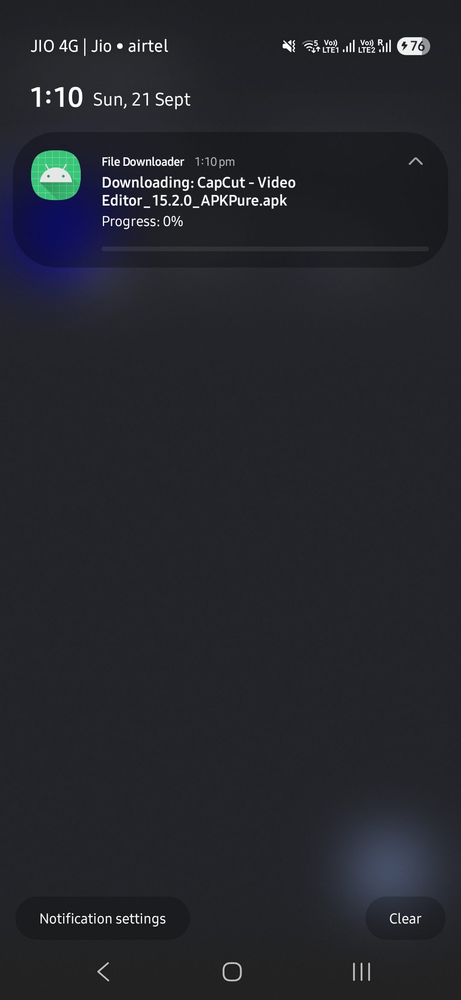
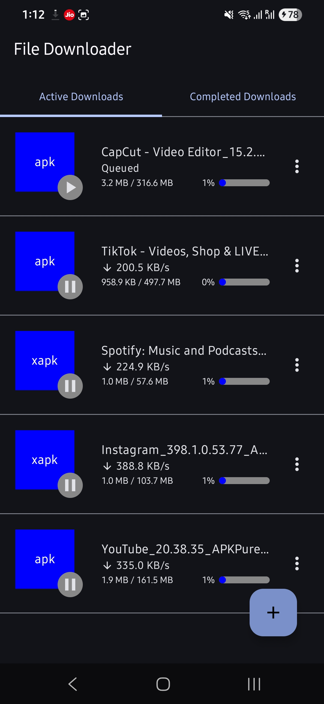
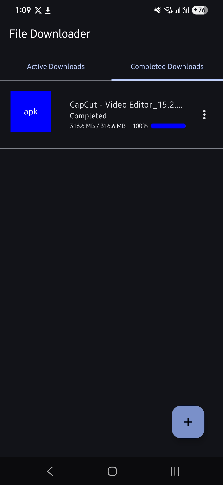

# File Downloader

File downloader app built using Jetpack Compose.

## Features

- Download files from internet using URL
- Ability to start/pause/resume downloads
- See notification for active and complete downloads
- Supports maximum 4 parallel active downloads
- Uses Room to store active and downloaded file information

## Screenshots

  
    
   
 